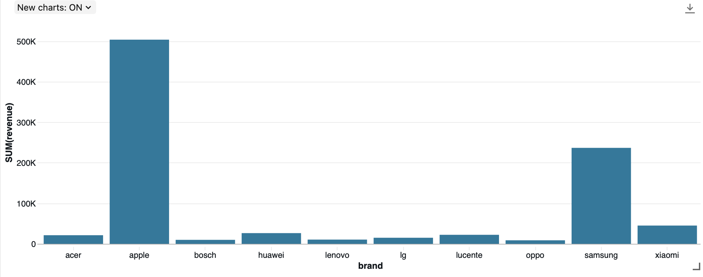
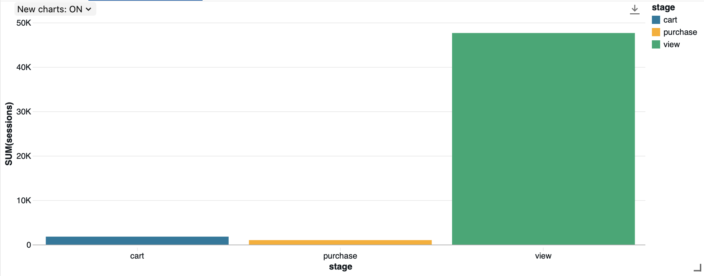
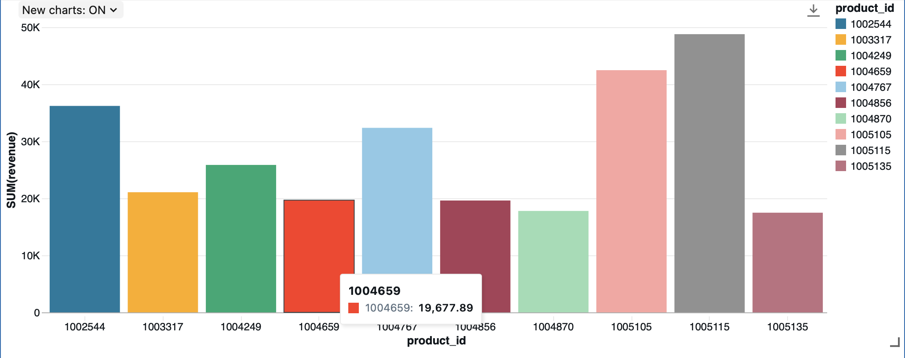

# Databricks E-commerce Analytics Pipeline

An end-to-end e-commerce event data pipeline built with **Databricks, PySpark, and SQL** using a Bronze–Silver–Gold architecture.

The project ingests raw clickstream data, performs data-quality checks and cleaning, builds business-ready analytics tables, and visualizes brand performance, product revenue, and session conversion behavior.

## Project Architecture

```text
Raw E-commerce CSV
        |
        v
Databricks Volume
        |
        v
Bronze Layer
Raw event data
        |
        v
Silver Layer
Deduplication
Type conversion
Data validation
Price filtering
        |
        v
Gold Layer
Brand revenue
Product revenue
Session funnel metrics
        |
        v
Databricks Visualizations
```

## Dataset

This project uses a **200,000-row sample** from the Kaggle *eCommerce behavior data from multi-category store* dataset.

The source data contains event-level e-commerce activity with fields including:

- `event_time`
- `event_type`
- `product_id`
- `category_id`
- `category_code`
- `brand`
- `price`
- `user_id`
- `user_session`

The full source dataset is not included in this repository because of its size.

## Pipeline

### Bronze Layer

The raw CSV is loaded from a Databricks Unity Catalog volume and saved as:

```text
workspace.bronze.ecommerce_events
```

The Bronze layer preserves the incoming source structure before cleaning.

### Data Quality Checks

Before transformation, the pipeline checks:

- event-type distribution
- missing values
- duplicate events
- duplicate frequency
- price range and non-positive prices

The 200,000 raw events contained duplicate records and missing values in `category_code` and `brand`.

### Silver Layer

The Silver layer creates a cleaned dataset by:

- removing duplicate events
- converting timestamps to `timestamp`
- converting IDs to numeric types
- converting `price` to `double`
- validating conversions for unexpected nulls
- removing non-positive prices

The cleaned table is stored as:

```text
workspace.silver.ecommerce_events_clean
```

### Gold Layer

The Gold layer contains business-ready analytics tables.

#### Brand Revenue

```text
workspace.gold.brand_revenue
```

Metrics:

- purchase count
- total revenue
- average purchase price

Example results:

| Brand | Purchases | Revenue | Avg. Purchase Price |
|---|---:|---:|---:|
| apple | 659 | 503,619.40 | 764.22 |
| samsung | 857 | 236,730.84 | 276.23 |
| xiaomi | 299 | 45,069.96 | 150.74 |

#### Session Conversion Funnel

```text
workspace.gold.funnel_metrics
```

The funnel is calculated at the **session level** rather than by simply dividing raw event counts. Each user session is checked for whether it contains a view, cart, and purchase event.

| Stage | Sessions | Conversion Rate |
|---|---:|---:|
| View | 47,645 | 100.00% |
| Cart | 1,788 | 3.75% |
| Purchase | 1,007 | 2.11% |

#### Product Revenue

```text
workspace.gold.product_revenue
```

The pipeline also ranks products by purchase revenue.

Example:

| Product ID | Purchases | Revenue |
|---|---:|---:|
| 1005115 | 50 | 48,778.50 |
| 1005105 | 30 | 42,464.40 |
| 1002544 | 78 | 36,198.84 |

This demonstrates that products with the highest sales volume do not necessarily generate the highest revenue.

## Visualizations

### Top Brands by Revenue



### Session Conversion Funnel



### Top Products by Revenue



## Technologies

- Databricks
- PySpark
- Spark SQL
- Unity Catalog
- Databricks managed tables
- Python
- Jupyter / Databricks notebooks

## Repository Structure

```text
databricks-ecommerce-pipeline/
|
├── README.md
├── notebooks/
│   └── brand_revenue_analysis.ipynb
├── images/
   ├── brand_revenue.png
   ├── conversion_funnel.png
   └── product_revenue.png
```
